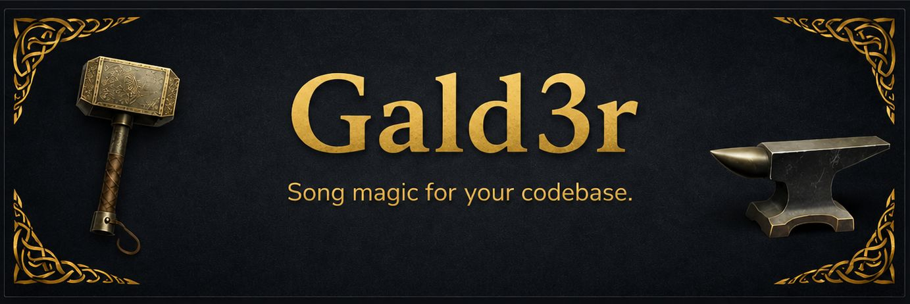

<p align="center">
  
</p>

<h1 align="center">gald3r</h1>

<p align="center">
  <strong>Your AI tools don't talk to each other. This fixes that.</strong>
</p>

<p align="center">
  <a href="../../releases"></a>
  
  
  
</p>

<p align="center">
  <a href="docs/quickstart.md">Quickstart</a> &nbsp;|&nbsp;
  <a href="docs/concepts.md">Concepts</a> &nbsp;|&nbsp;
  <a href="docs/cli-reference.md">CLI Reference</a> &nbsp;|&nbsp;
  <a href="CHANGELOG.md">Changelog</a> &nbsp;|&nbsp;
  <a href="https://github.com/Gald3r-Labs/gald3r">The Framework</a>
</p>

---

Cursor keeps its own notes. Claude Code keeps different ones. Copilot keeps none. Every tool
rediscovers your project from scratch, every session, forever — and none of them remember the
decision you made last Tuesday about why the auth layer works the way it does.

gald3r gives them **one shared brain**. Tasks, bugs, plans, constraints, and decisions live in your
repo, in plain files, in a real database — and every AI tool on your machine reads and writes the
same state. Switch from Cursor to Claude Code mid-feature and nothing is lost. Your teammate opens
the repo tomorrow and their agent already knows what yours decided.

One signed binary. No IDE required. Works with 30+ AI platforms.

```powershell
gald3r setup          # your project now has a brain
gald3r task ready     # what's actually runnable, right now
gald3r autopilot loop # agents implement, independent agents review, all night
```

## What you get

**A project brain that outlives any session.** `.gald3r/` holds your tasks, bugs, plans,
constraints, and architectural decisions — human-readable Markdown backed by SQLite. Git-tracked,
diffable, reviewable in a PR. Your agents stop guessing and start reading.

**CRASH: guidance that actually executes.** Commands, Rules, Agents, Skills, and Hooks. Most AI
tooling gives your assistant a markdown file and hopes it complies. CRASH components *run* — a rule
that says "never commit secrets" is a hook that blocks the commit, not a paragraph an LLM might
skim past.

**An agent runtime that isn't a wrapper.** `gald3r chat` and `gald3r run` drive local models
(Ollama, LM Studio, vLLM) or cloud providers, with a default-deny network gate around sandboxed
runs. Your model choice, your machine, your rules.

**Autopilot that grades its own homework — honestly.** `gald3r autopilot loop` runs rolling
implement-then-review cycles where the reviewing agent is always a *different* agent with no memory
of writing the code. It fails work that doesn't meet its acceptance criteria, sends it back, and
tries again. It is not a yes-man.

**Signed, and verifiable.** Every release is Authenticode-signed as Gald3r Labs LLC with a
timestamp countersignature and ships a SHA-256 sidecar. Check it before you run it — instructions
below, and we'd rather you did.

## Install

**Download the installer, double-click, done.**

### [⬇ gald3r-windows-x86_64.msi](../../releases/latest) — Windows

Run it. It puts `gald3r` on your PATH and shows up in Add/Remove Programs like anything else.
Signed by Gald3r Labs LLC, so Windows won't fight you about it.

Then open a **new** terminal (or restart your IDE — running processes keep the old PATH):

```powershell
gald3r --version
gald3r setup      # in any project — this is the good part
gald3r status
```

<details>
<summary><strong>Prefer the standalone binary?</strong> (no installer, portable)</summary>

Grab `gald3r.exe` from the [latest release](../../releases/latest) and drop it anywhere on your
PATH. Same binary the MSI installs.

```powershell
New-Item -ItemType Directory -Force "$env:USERPROFILE\.local\bin" | Out-Null
Move-Item .\gald3r.exe "$env:USERPROFILE\.local\bin\gald3r.exe"
# ensure %USERPROFILE%\.local\bin is on your PATH, then restart your terminal
```
</details>

<details>
<summary><strong>Paranoid? Good.</strong> Verify the signature and hash</summary>

Every artifact is Authenticode-signed and ships a SHA-256 sidecar:

```powershell
(Get-AuthenticodeSignature .\gald3r-windows-x86_64.msi).Status   # -> Valid
(Get-FileHash .\gald3r-windows-x86_64.msi -Algorithm SHA256).Hash.ToLower()
Get-Content .\gald3r-windows-x86_64.msi.sha256                   # -> must match
```
</details>

**macOS and Linux** ship at 4.0.0 — signed, notarized, same release.

## Part of a larger system

gald3r is one piece of a coordination platform. Each part stands alone; together they let humans and
AI agents work the same projects without stepping on each other.

| | |
|---|---|
| **[Gald3r-Labs/gald3r](https://github.com/Gald3r-Labs/gald3r)** | The framework — CRASH components, project templates, and the platform overlays that teach 30+ AI tools to speak the same language. Start here to understand the system. |
| **Gald3r-Labs/gald3r_core** *(this repo)* | The compiled binary that runs it all. One file, no runtime. |
| **Throne** | The desktop app — visual project control for people who'd rather not live in a terminal. |
| **Valkyrie & world_tree** | The network layer: live agent-to-agent and agent-to-human coordination, and shared project state across a team. |

**gald3r 4.0** is the first release where the framework and a compiled binary ship as a matched
pair — same version, same line. Framework v3.x was template-only.

## Documentation

| | |
|---|---|
| [Quickstart](docs/quickstart.md) | Install → first project → first useful command |
| [Concepts](docs/concepts.md) | CRASH, `.gald3r/`, tasks and bugs, sessions |
| [CLI reference](docs/cli-reference.md) | Every verb, grouped by what you're trying to do |
| [Changelog](CHANGELOG.md) | What shipped, and when |

## Where this is going

**Today:** Windows, signed, working. **Next (4.0.0):** macOS and Linux signed and notarized,
shipping together, plus an MSI and `winget install gald3r`.

This is a **4.0 prerelease** and it moves fast. Some verbs are deep, some are thin, and a few want
optional network services. If something's rough, [tell us](../../issues) — that's the fastest path
from rough to right.

## License

[Fair Source License 1.1 (FSL-1.1-Apache)](LICENSE) — © 2025–2026 Gald3r Labs LLC. Free for
internal use, education, research, and professional services; each release converts to Apache 2.0
on its second anniversary. Build on it, ship with it — just don't resell gald3r as gald3r.
